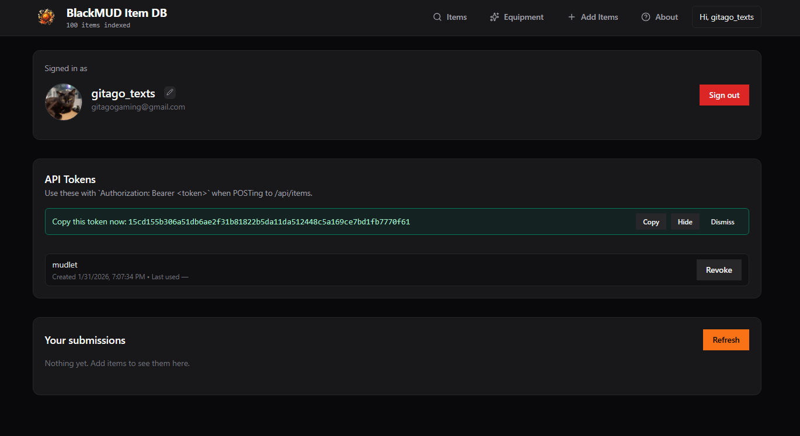

## BlackMUD ItemDB Helper Package

This package was designed for the players of BlackMUD to have an easy way to submit items they have identified into the community item database so that players, new and old are able to quickly look up various items stats and try and determine the high/low for various items due to them having a /random/ stat gen.

This package is new and may have some issues along the way where it may not capture identifies as expected. 

### On First Startup

Before you can submit items to the database you will need to create an account via [BlackMUD ItemDB](https://bm-itemdb.gitago.dev/account)

Sign up for an account you can then create an API token which can be used to set up the package.

Once you acquire the token from the ItemDB you can hop in Mudlet and type in the command as seen below.
Be sure you are replacing `<TOKEN>` with your actual token from the website.

> `itemdb.token <TOKEN>`

### Whats next?

After thats done, you should have a confirmation message shown and you can begin sending items to the database now directly from Mudlet.. 

You can test it by reciting an identify and await for it to capture. 
You will be prompted with a clickable button/text that will open your inventory. 

When it opens your inventory its going to attach a link to the end of each line.
You will then click the item you just identified and this is how we are capturing the short-description of the item.

After that the submission is complete and you should be able to find it via the website.

---

If you run into any issues along the way please reach out to Gitago via the discord.

